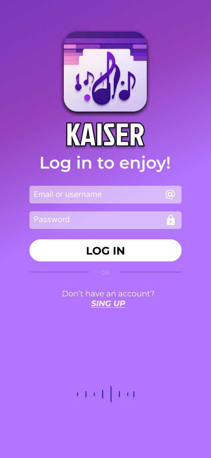

# kaiser-music
Projeto app musica figma 

<a href="https://www.figma.com/file/QmeMjWnfPECBInFsBOWtvv/Kaiser-smart-phone?type=design&amp;node-id=0%3A1&amp;mode=design&amp;t=IruI8PWnIH1L19qu-1">KAISER</a>

<h1>Versão mobile</h1>

<h2>Tela de Login</h2>

<h2>Tela inicial</h2>

<h2>Tela de Musica</h2>

<h1>Versão Apple Watch</h1>

<h2>Tela de Login</h2>

<h2>Tela Inicial</h2>

<h2>Tela de Musica</h2>

